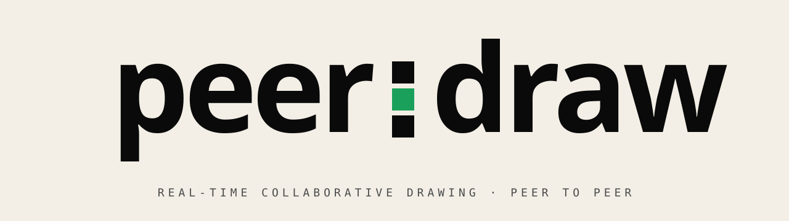

<!-- Hero -->
<p align="center">
  <picture>
    <source media="(prefers-color-scheme: dark)" srcset="./assets/banner-dark.svg" />
    
  </picture>
</p>

<p align="center">
  <a href="https://pws-wobbuffet.github.io/peerdraw/">
    
  </a>
  
  
  
</p>

---

> **Real-time collaborative drawing. No server. No account. Just draw.**
> Open the page, share the link, draw together. Your strokes go directly to the other person's browser — peer-to-peer, end-to-end, nothing stored anywhere.

Most collaborative whiteboards run your every brush stroke through a server farm. **peerdraw doesn't.** A signaling relay introduces two browsers, then steps out of the way. From the first stroke onward, your data flows directly between you and your collaborator. **No middleman. No history. No backups.**

```
$ curl peerdraw.app
> no canvas state here. it lives in your tab, not ours.
```

<br />

## ▣  01 · HOW IT WORKS

```
┌─ PERSON A ──────────────┐                    ┌─ PERSON B ──────────────┐
│  opens the app          │                    │                         │
│  → creates a room       │                    │                         │
│  → shares the link  ────┼──► (PeerJS relay)──┼──► opens the link       │
│                         │   1-second hand-   │   → joins the room      │
│  ┌────────────────────┐ │   shake. relay     │ ┌────────────────────┐  │
│  │  canvas            │◄┼───── exits ───────►│ │  canvas            │  │
│  │                    │ │  P2P WebRTC link   │ │                    │  │
│  └────────────────────┘ │                    │ └────────────────────┘  │
└─────────────────────────┘                    └─────────────────────────┘
                          ▲                    ▲
                          └──── data channel ──┘
                               (no server)
```

1. **Person A** opens the app and clicks **Create session** — a room link appears
2. **Person A** shares the link (or generates a QR via [privqr](https://pws-wobbuffet.github.io/privqr/))
3. **Person B** opens the link — connection established in ~1s
4. Both draw in real time. Strokes hop directly browser-to-browser.

The only "server" involved is **PeerJS's public signaling relay**, used for the initial WebRTC handshake (~1 second). After that the connection is purely peer-to-peer and the relay is completely out of the picture. Drawing data never touches any server.

<br />

## ▣  02 · WHY

|                       | Other whiteboards    | **peerdraw**          |
| --------------------- | -------------------- | --------------------- |
| Where strokes go      | Their server         | Directly to your peer |
| Account required      | Often                | Never                 |
| Strokes stored        | Forever              | Nowhere               |
| Works without backend | No                   | Yes — there isn't one |
| Latency               | RTT × 2 (via server) | RTT × 1 (direct)      |

You don't need an account to scribble on a napkin. You shouldn't need one to scribble on a screen.

<br />

## ▣  03 · RUN LOCALLY

```bash
git clone https://github.com/pws-wobbuffet/peerdraw.git
cd peerdraw
pnpm install
pnpm dev
# → open http://localhost:4321/peerdraw/
```

Build for production:

```bash
pnpm build      # static export → ./dist
pnpm preview    # serve the build locally
```

<br />

## ▣  04 · STACK

```
Astro 6 ──────── build-time bundling, zero-runtime transpiler
React 18 ─────── interactive UI islands
PeerJS   ──────── WebRTC DataChannel wrapper + signaling
Canvas API ───── pointer events · quadratic bezier smoothing
GitHub Pages ─── static hosting via GitHub Actions
```

**No backend. No database. No analytics.** Just static files and a public WebRTC relay.

<br />

## ▣  05 · FEATURES

- **Names + colour** — pick your display name and identity colour at session start
- **6 brush colours + custom picker** — quick palette, infinite fallback
- **3 stroke sizes** — thin / medium / thick
- **Live peer cursor** — see your collaborator's pointer in real time
- **Session chat** — text alongside drawing
- **Bomb effects** — ink splat, erase blast, rainbow ripple
- **🎨 Pictionary mode** — draw a word, your peer guesses; 5 rounds, alternating roles
- **⚔️ Color War mode** — claim territory with your colour; pixel count decides the winner
- **Clear canvas** — both peers' boards sync instantly
- **Shareable room links** — paste anywhere, or scan via [privqr](https://pws-wobbuffet.github.io/privqr/)
- **Light + dark mode** — auto-detect, manual override
- **Session URL persistence** — reload and rejoin your own room

<br />

## ▣  06 · CONTRIBUTING

PRs welcome. Good first targets:

```
canvas tools    →  src/components/Canvas.jsx
toolbar tools   →  src/components/Toolbar.jsx
game modes      →  src/components/App.jsx
bug reports     →  github.com/pws-wobbuffet/peerdraw/issues
```

See [CONTRIBUTING.md](./CONTRIBUTING.md) for the full playbook.

<br />

## ▣  07 · LICENSE

[**MIT**](./LICENSE) — do whatever, just don't sue us.

<br />

---

<p align="center">
  <sub>Made for humans · Pairs nicely with <a href="https://pws-wobbuffet.github.io/privqr/"><b>privqr</b></a> · No servers harmed.</sub>
</p>
